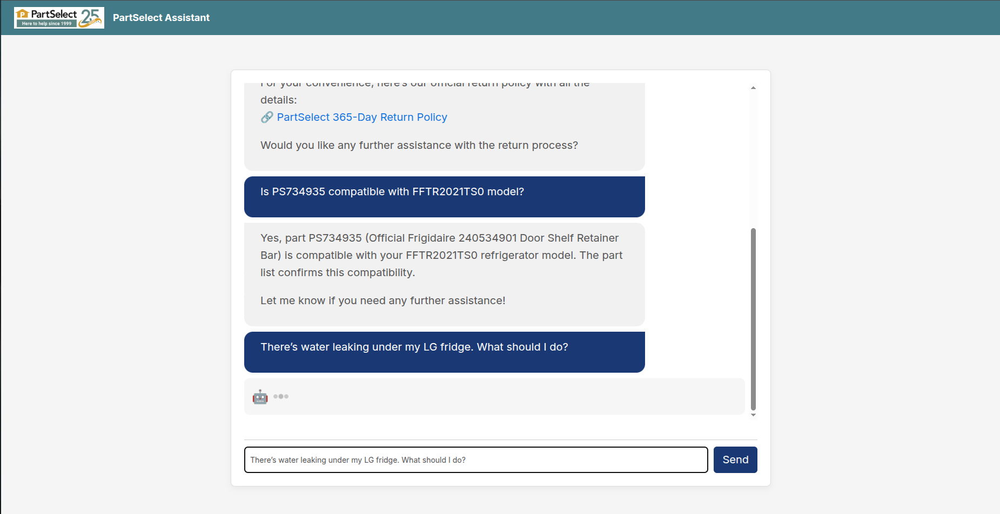

# PartSelect AI Assistant 🤖

A natural-language assistant built with **React + FastAPI**, designed to help customers of [PartSelect](https://www.partselect.com) find and confirm refrigerator or dishwasher parts. It uses **DeepSeek LLM**, **Brave Search**, and real-time **compatibility checks via ScraperAPI** to deliver fast, relevant answers.

---

## 🧠 What It Does

- ✅ Understands customer queries using DeepSeek LLM
- 🧊 Answers only **refrigerator** and **dishwasher** part questions
- 🔒 Rejects off-topic or unsupported appliance types
- 🔍 Verifies **part compatibility** with specific model numbers using ScraperAPI
- 🛠️ Provides **repair instructions** from official PartSelect pages
- 🔁 Shares **return policy** when asked about returns
- 📦 Simulates order handling with realistic fictional order numbers (e.g., `#PS123456789`)
- 🤖 Features a sleek UI with typing animations and quick-action buttons

---

## 🧩 Core Logic & Design

### 1. Grounded Repair Knowledge (cache_summaries/)

To ensure responses are **fact-based**, we run a script `cache_scraper_pages.py` that:

- Fetches HTML from official PartSelect repair guides via ScraperAPI
- Parses and cleans the text using BeautifulSoup
- Summarizes it using DeepSeek Chat API
- Saves the summaries to `cache_summaries/`, which are injected at runtime as repair knowledge

➡️ This approach significantly reduces hallucination risk and aligns answers with official repair guidance.

---

### 2. LLM Prompt Rules (BASE_RULES)

All user conversations begin with this strict prompt to ensure domain accuracy:

- Only refrigerator and dishwasher parts are supported
- Alternative parts are not suggested unless explicitly requested
- Repair URLs must be exact and official
- Return questions always link to:
  👉 https://www.partselect.com/365-Day-Returns.htm
- Order inquiries simulate a real system (e.g., return/cancel) without real user data

---

### 3. Compatibility Checking with ScraperAPI

When a user mentions a **model number** and a **part number**, we send a compatibility request to PartSelect:

```
https://www.partselect.com/Models/{model}/Parts/?SearchTerm={part}
```

- If parts appear: ✅ compatible
- If “sorry, we couldn't find any parts that matched” appears: ❌ not compatible

The result is embedded into the system message for the LLM to reason with.

---

### 4. Order System Simulation (Extensible)

Currently, the assistant **generates fake order numbers** to help simulate real transactions. However, the backend is designed for realistic expansion:

- Extend to support authentication and user-based order resolution
- Integrate real APIs in future while maintaining safety during development

---

## 🖼️ Demo Preview



---

## 📦 Tech Stack

| Layer         | Tech                      |
|---------------|---------------------------|
| Frontend      | React (CRA), CSS          |
| UI Components | Ant Design                |
| Backend       | FastAPI (Python 3.10+)    |
| LLM API       | DeepSeek Chat             |
| Search Engine | Brave Search API          |
| Compatibility | ScraperAPI                |
| Data Source   | PartSelect.com            |

---

## 🛠️ Local Development Setup

### 1. Clone the Repo

```bash
git clone https://github.com/your-username/partselect-chat-agent.git
cd partselect-chat-agent
```

### 2. Start the Backend First

Inside the `./backend` folder, make sure Python ≥ 3.10 is installed and run:

```bash
pip install -r requirements.txt
uvicorn main:app --reload
```

This starts the FastAPI backend server with auto-reload enabled for development.
⚠️ **Make sure the backend is running before starting the frontend** — some features depend on the backend being active.

Runs at: `http://localhost:8000`

### 3. Install and Start the Frontend

From the root directory (where `package.json` is located), run:

```bash
npm install
npm start
```

This starts the React app on: `http://localhost:3000`

---

## 📁 Environment Variables

Create a `.env` in the backend folder:

```env
DEEPSEEK_API_KEY=your_deepseek_api_key
BRAVE_API_KEY=your_brave_api_key
SCRAPER_API_KEY=your_scraperapi_key
```

Set your React app environment:

```env
REACT_APP_API_URL=http://localhost:8000
```

---

## 💬 Sample Queries to Try

| Type              | Example                                                   |
|-------------------|-----------------------------------------------------------|
| Compatibility     | "Is PS3406971 compatible with model FFTR2021TS0?"        |
| Appliance Issue   | "The ice maker on my Whirlpool fridge isn’t working"      |
| Part Inquiry      | "What is PS11770644?"                                     |
| Return Request    | "I want to return my order"                               |
| Off-topic Test    | "Tell me a joke"                                          |

---

## 🙋‍♂️ Maintainer

Built by **Sunghwan Baek** @ Carnegie Mellon University  
sunghwab@andrew.cmu.edu

---

## 📝 License

MIT License. This project is independent and not affiliated with PartSelect.com.
